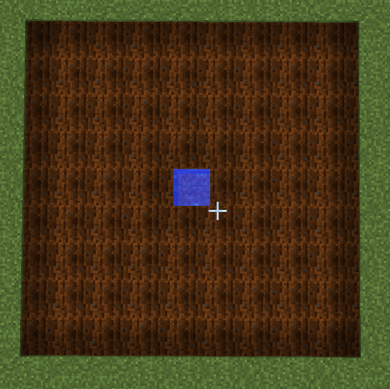
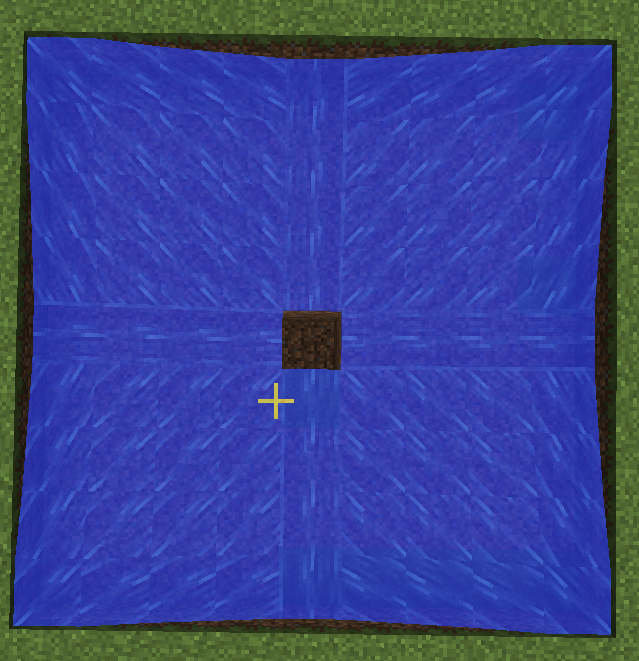

# 流水式收割机

利用流水能够冲走作物并且不会破坏耕地的这个特点, 能够制作出简单实用的自动收割装置. 绝大多数的农作物自动收割装置都利用了这个特性.下面介绍其中最为常见的一类机械.

这种机械的农田部分如下图, 由一块 9x9 的耕地组成, 中间部分是一块水方块. 一块水方块能够湿润的范围也恰好是这么大.

用于冲刷的流水从该耕地的四个角落流出, 并汇集于中心.

流水刚好会止于中心, 冲刷出的物品于是会掉落到其中, 这下面可以放置漏斗收集, 或是水道继续运输物品.

